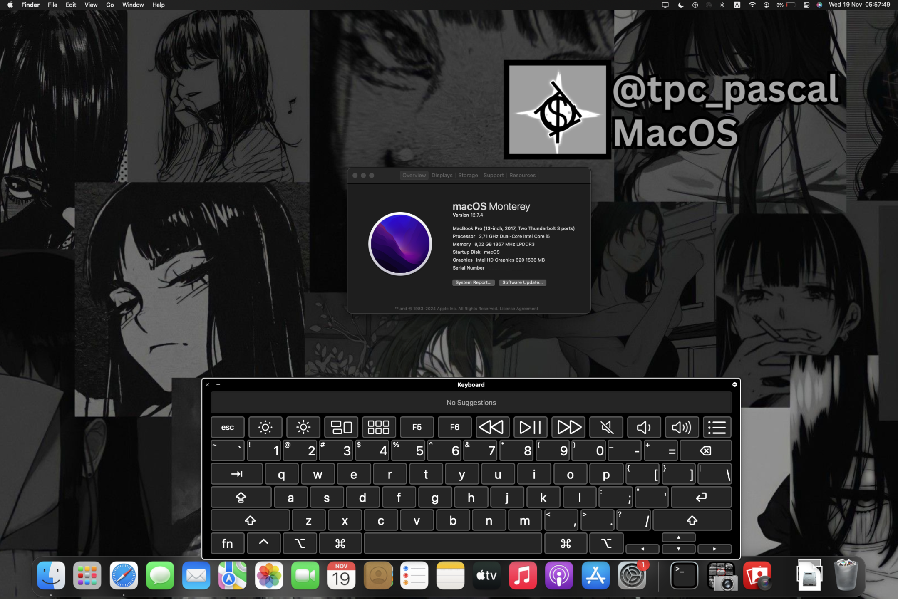

# OpenCore-PANA-CFXZ6-Monterey

OpenCore EFI folder for Panasonic Let's Note / Toughbook CF-XZ6.

<p align="center">
  
</p>

<p align="center">
  
  
  
</p>

---

## 🎉 Tác giả

[](https://github.com/tpc-pascal/OpenCore-PANA-CFXZ6-Monterey/graphs/contributors)
<details open>
<summary><b>🔍 Các thành viên</b></summary>

| STT | Tên | Vai trò |
|:---:|:---|:---|
| 1 | [tpc-pascal](https://github.com/tpc-pascal) | Phân tích hệ điều hành |
</details>

## 💻 Cấu hình phần cứng (System Specs)
Danh sách phần cứng đã được kiểm chứng trên thiết bị thực tế:

| Thành phần | Chi tiết | Ghi chú |
| :--- | :--- | :--- |
| **Model** | Panasonic Let's Note CF-XZ6 | Toughbook series |
| **CPU** | Intel® Core™ i5-7300U (Kaby Lake) | 2 Cores / 4 Threads |
| **iGPU** | Intel® HD Graphics 620 | Metal Supported |
| **RAM** | 8GB LPDDR3 | |
| **Storage** | 256GB SSD (macOS) + 500GB HDD | |
| **WLAN/BT** | Intel® Dual Band Wireless-AC 8265 | ITWM / BlueToolFixup |
| **Ethernet** | Realtek RTL8111 | Native Support |

---

## 🛠 Tình trạng hoạt động (Status)

### ✅ Hoạt động (Working)
- [x] **Graphics:** Intel HD 620 (Full Acceleration).
- [x] **I/O Ports:** USB-C, USB-A, HDMI, VGA hoạt động ổn định.
- [x] **Connectivity:** LAN, SD Card Slot hoạt động tốt.
- [x] **Display:** Touchscreen nhận diện đa điểm ổn định.
- [x] **Audio:** Realtek Audio (Internal Speakers & Jack).

### ⚠️ Chưa ổn định (Issues/Bugs)
- [ ] **Input:** Keyboard & Touchpad (Hoạt động không ổn định, thường xuyên mất nhận diện).
- [ ] **Camera:** Nhận diện ngẫu nhiên (Inconsistent).
- [ ] **Power Management:** Lỗi Wake from Sleep (Thường xuyên gặp lỗi màn hình đen sau khi ngủ).

---

## 📁 Cấu trúc thư mục

```text
OpenCore-PANA-CFXZ6-Monterey/
├── EFI/
│   ├── Boot/
│   └── OC/
├── Tools/
│   └── EFI_Config.bat
├── .gitignore
├── CONTRIBUTING.md
├── CREDITS.md
├── GUIDE.md
├── LICENSE
├── macOS_CFXZ6.png
└── README.md
```

## 💌 Guide

Nếu bạn muốn tự làm thì hướng dẫn tại [GUIDE.md](./GUIDE.md)

## ✈ Hướng dẫn đóng góp

Đọc thêm tại [CONTRIBUTING.md](./CONTRIBUTING.md)

## 🙏 Nguồn tham khảo

Đọc thêm tại [CREDITS.md](./CREDITS.md)
